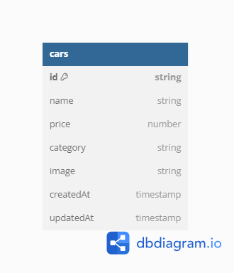

# DIagram

# Step
1. npm Install
2. buat file .env, copy env variable dari .env.example
3. npm run dev

# Page link

PORT : localhost:8000

- / = Dashboard Admin
- /create =  Halaman creat new car
- /upload = action untuk create new car
- /edit/:id = Halaman edit car
- /update/:id = action untuk update data
- /delete/:id = action untuk delete data